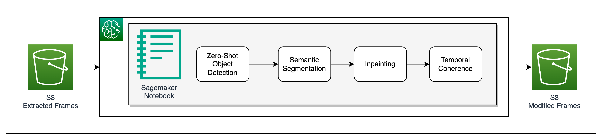

# Zero Shot Learning Object Detection and Segmentation

This repository contains code and resources for performing zero-shot object detection and segmentation using deep learning techniques. Zero-shot learning enables the model to detect and segment objects from classes that were not seen during training, by leveraging semantic information and transferring knowledge from seen classes.

## AWS Architecture:


## AWS CloudFormation Stack Creation
The AWS CloudFormation Stack can be created using 2 methods: (1) Using Template or (2) Using AWS CDK. Both the methods are described as follows:

1. [WIP] Create Stack using AWS CloudFormation:
    - Choose **Launch Stack** and (if prompted) log into your AWS account:
    [](https://console.aws.amazon.com/cloudformation/home#/stacks/create/review?templateURL=https://aws-blogs-artifacts-public.s3.amazonaws.com/artifacts/ML-13353/yolov8-pytorch-cfn-template.yaml)
    - Select a unique Stack Name, ackowledge creation of IAM resources, create the stack and wait for a few minutes for it to be successfully deployed

2. Using AWS CLI:
    - If AWS CLI is installed, use it to create the CloudFormation Stack:
    ```
    $ git clone https://github.com/aws-samples/zero-shot-learning-object-detection-and-segmentation
    $ cd zero-shot-learning-object-detection-and-segmentation
    $ aws cloudformation create-stack \
        --stack-name ZSL-STACK \
        --template-body file://zsl-cdk.yaml \
        --capabilities CAPABILITY_IAM
    ```

## Steps to run:
1. Once the Stack is created, navigate to SageMaker in AWS Console
2. From SageMaker -> Notebooks -> Open ZSL Notebook
3. Follow the steps in the Notebook

## Security
See [CONTRIBUTING](CONTRIBUTING.md#security-issue-notifications) for more information.

## License
This library is licensed under the MIT-0 License. See the LICENSE file.

## Contributors
- Fabian Benitez-Quiroz
- Junjie Tang
- Romil Shah
